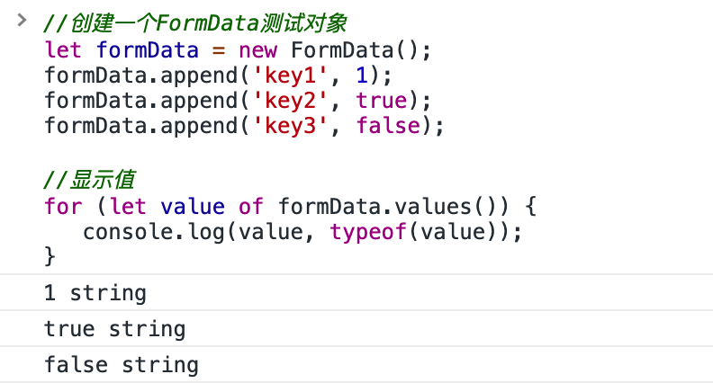
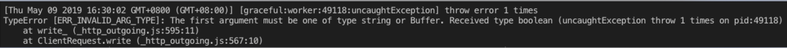

# formData 对象隐藏坑
> [formData 传送门](https://developer.mozilla.org/zh-CN/docs/Web/API/FormData/Using_FormData_Objects)  

`formData` 对象，我们一般用于表单的文件上传。关于这个对象有一点，我们必须要注意，那就是：  
**划重点：对象里的 key 所对应的值都是 string**
（敲黑板，下面要考的）  
  
从图上可以看出，被 `append` 进 `formData` 对象的值，最后都变成了 `string`。  
最近我连续两次踩进了 `string` 的坑。  

### 坑一：
微信小程序上传文件 `api`, [wx.uploadFile](https://developers.weixin.qq.com/miniprogram/dev/api/wx.uploadFile.html) 用的就是 `formData`，官方例子长酱紫：  
```
wx.chooseImage({
  success(res) {
    const tempFilePaths = res.tempFilePaths
    wx.uploadFile({
      url: 'https://example.weixin.qq.com/upload', // 仅为示例，非真实的接口地址
      filePath: tempFilePaths[0],
      name: 'file',
      formData: {
        user: 'test'
      },
      success(res) {
        const data = res.data
        // do something
      }
    })
  }
})
```
小程序环境中没有 `formData` 对象，不能直接构造，但好像直接把一个普通对象放进 `uploadFile` 的 `formData` 中就可以了，行吧  
我用的时候，类似这样：  
```
wx.chooseImage({
  success(res) {
    const tempFilePaths = res.tempFilePaths
    wx.uploadFile({
      url: 'https://example.weixin.qq.com/upload', // 公共服务，统一文件上传接口
      filePath: tempFilePaths[0],
      name: 'file',
      formData: {
        public: true,
        type: 1
      },
      success(res) {
        const data = res.data
        // do something
      }
    })
  }
})
```
感觉没毛病啊，但接口报错，各种上传不成功，问了其他做过上传功能的同学，他们说「额，把 `public: true` 改成 `public: 'true'` 」 就可以了...  
他们也不知道为啥？不是微信小程序的锅，就是后端开发小哥的锅，把参数类型定义错了  
我确定之前在 `web` 端使用这个统一文件上传接口的时候，`public` 参数肯定是 `Boolean` 类型的。  
那这是微信小程序的锅？不接受 `Boolean` ?之后我又滚回去仔细看了 `formData` 对象，`formData` 出来的值全都变成了 `string`，所以这是 `formData` 对象约定的？  
但为嘛不接受 `Boolean` 却接受了 `Number` ？不公平啊，而且为何小程序不将 `Boolean` 转成 `String` 后再使用？这样我们就不用操心类型的问题了，行吧，已经能够上传了，又可以愉快的写代码了  

### 坑二
就在我结束了微信小程序开发后，我回到了 `node` 的怀抱。然后遇到了坑二。  
背景：  
我要写一个 `node` 包，对接前面那个统一服务上传接口。从客户端拿到了文件对象，再拿到了 `filepath` 后，经过一系列的加密、解密、鉴权...  
终于到了，模拟 `form-data` 发送文件的关键时刻，代码大致长这样：  
```
const fs = require("fs");
const request = require("request");

const options = {
  method: 'POST',
  url: 'https://example..com/upload',
  headers: {
    'cache-control': 'no-cache',
    'content-type': 'multipart/form-data; boundary=----WebKitFormBoundary7MA4YWxkTrZu0gW'
  },
  formData: {
    public: true,
    type: 1,
    uploadfile: {
      value: fs.createReadStream(filepath),
      options: { filename: 'DSC00520_72.jpg', contentType: null }
    }
  }
};

request(options, function(error, response, body) {
  if (error) throw new Error(error);

  console.log(body);
});
```
感觉没毛病，然鹅！历史总是惊人的相似，它！报错了！  

总之报错信息就是： `request` 说它希望收到的是 `buffer` 或 `string` 但我却给了它 `Boolean` ，纳尼？什么 `Boolean` ，哪里有 `Boolean` 了？挣扎啊挣扎，我看着 `Boolean` ，然后灵感一闪，这不是跟小程序上传遇到的问题一毛一样么...  
然后问题就被解决了，又可以愉快的写代码了  


### 总结：  
两个坑都是再进行 `from-data` 类型的请求时，在 `formData` 对象中使用了 `Boolean` 值  
所以，全改为 `String` 吧，安全  