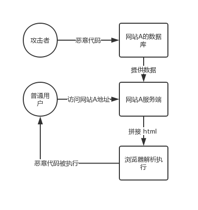

# xss
> [ xss 跨站脚本攻击](https://developer.mozilla.org/zh-CN/docs/Glossary/Cross-site_scripting)
Cross-Site Scripting（跨站脚本攻击）为了与 CSS 区别，简称为 XSS，是一种安全漏洞。攻击者利用这个安全漏洞在目标网站上注入恶意脚本，一旦这些恶意脚本被运行。攻击者则可以利用这些恶意脚本获取用户的敏感信息如 Cookie 或恶意导流到攻击者的恶意网站等或影响目标网站的正常运行。

## 恶意脚本是如何被注入的？
* 用户生产的内容
* 来自第三方的链接
* URL 参数
* POST 参数
* Referer （可能来自不可信的来源）
* Cookie （可能来自其他子域注入）

## xss 分类
### 存储型 xss
存储型 XSS 的攻击步骤：
1. 攻击者将恶意代码提交到目标网站的数据库中。
2. 用户打开目标网站时，网站服务端将恶意代码从数据库取出，拼接在 HTML 中返回给浏览器。
3. 用户浏览器接收到响应后解析执行，混在其中的恶意代码也被执行。
4. 恶意代码窃取用户数据并发送到攻击者的网站，或者冒充用户的行为，调用目标网站接口执行攻击者指定的操作。
这种攻击常见于带有用户保存数据的网站功能，如论坛发帖、商品评论、用户私信等。

### 反射型 xss
### DOM 型 xss