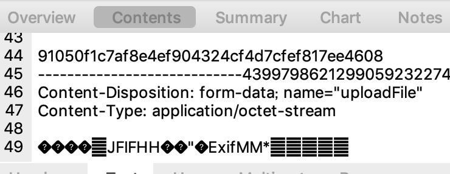

# egg 文件上传

> [ egg 获取文件官方说明](https://eggjs.org/zh-cn/basics/controller.html#%E8%8E%B7%E5%8F%96%E4%B8%8A%E4%BC%A0%E7%9A%84%E6%96%87%E4%BB%B6)

egg 提供了两种获取文件的模式，一种是 `stream`，另一种是 `file`。  

### file
如官方所说，通过 `this.ctx.request.files[0]` 就能拿到文件对象。  
如果要做上传的话，可以通过 `request` 进行模拟 `form-data` 发送，代码类似：  

```javascript
const Controller = require('egg').Controller;
const mzFs = require('mz/fs');
const fs = require('fs');
const request = require('request');

class HomeController extends Controller {
  async upload() {
    const { ctx } = this;
    let result;
    const file = ctx.request.files[0]; // 注意不要忘了在 config 中将模式改为 file 模式

    try {
      // 上传到文件服务
      result = await this.uploadFile(file);
    } finally {
      // 需要删除临时文件
      await mzFs.unlink(file.filepath);
    }
    ctx.body = {
      result,
    };
  }

  uploadFile( file ){
    return new Promise((resolve, reject) => {
      request({
        method: 'POST',
        url: 'https://xx.com/upload',
        headers: {
          'cache-control': 'no-cache',
          'content-type': 'multipart/form-data; boundary=----WebKitFormBoundary7MA4fsdYWxkTrZu0gW',
        },
        formData: {
          key1: 1,
          key2: 'true', // 绝不能在 formData 的 value 中出现 Boolean，原因参见 base/formData 对象隐藏坑.md
          key3: { // key3 为文件字段
            value: fs.createReadStream(file.filePath), // 创造可读流
            options: {
              filename: file.filename,
              'Content-Type': file.minType,
            },
          },
        },
        json: true,
      }, (err, res, body) => {
        if (err) {
          reject(err);
        } else {
          resolve(body);
        }
      });
    })
  }
}

module.exports = HomeController;

```

### stream
`egg` 提供的 `fileStream` 是 `readStream` 的子类，当然也可以用于上传。只是中间有一个坑。  
大概是因为 `request` 太过出名，许多人会使用 `request` 进行请求。方法与上面的 `file` 类似，然后就会发现，这样行不通，原因可参见这个[issues](https://github.com/eggjs/egg/issues/3201)。  
主要是因为 `request` 依赖的 `form-data` 包如果发现传进去的流不是来自文件或者 `http` 响应的流，会拒绝，这就导致了查看请求的时候会发现，请求的内容的残缺的，文件不全。  
  
这时候我们可以换一个请求工具，如 `unirest`，代码类似：  
```javascript
const Controller = require('egg').Controller;
const sendToWormhole = require('stream-wormhole');

class HomeController extends Controller {
  async upload() {
    const { ctx } = this;
    let result;
    const stream = await ctx.getFileStream();
    try {
      result = await this.uploadFile(stream);
    } catch (err) {
      // 必须将上传的文件流消费掉，要不然浏览器响应会卡死
      await sendToWormhole(stream);
      throw err;
    }

    ctx.body = {
      result,
    };
  }

  uploadFile( stream ){
    const req = unirest('POST', 'https://xx.com/upload');

    return new Promise((resolve, reject) => {
      req.headers({
        'cache-control': 'no-cache',
        'content-type': 'multipart/form-data; boundary=----WebKitFormBoundary7MA4fsdYWxkTrZu0gW',
      });

      req.multipart([
        {
          'Content-Disposition': 'form-data;name="key1"',
          body: 1,
        },
        {
          'Content-Disposition': 'form-data;name="key2"',
          body: 'true', // 绝不能在 formData 的 value 中出现 Boolean，原因参见 base/formData 对象隐藏坑.md
        },
        {
          'Content-Disposition': 'form-data;name="uploadFile";filename="tmp.jpg"',
          'Content-Type': 'image/jpeg',
          body: stream,
        },
      ]);

      req.end(function(res) {
        if (res.error) {
          reject(res.error);
        }
        resolve(res.body);
      });

    })
  }
}

module.exports = HomeController;
```