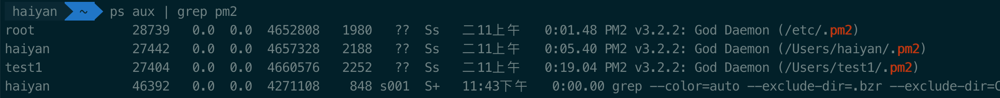

# pm2 list 隐藏技能
> `pm2` 是什么？[传送门](http://pm2.keymetrics.io/)  
> `pm2 list` 指令可以查看通过 `pm2` 进行管理的 `node` 服务。

故事的起因：  
某天某同学觉得我们的前端测试服务器 `ubuntu` 版本太低啦，想升级一波，问我会不会影响到上面跑的服务。  
这...实践是检验真理的唯一标准，没试过，我也不知道会不会出现哪个服务会崩啊  
为了尽量规避风险，我们准备升级前先将重要的服务迁移出来，幸好上面的 `node` 服务都是用的 `pm2` 进行管理的，`pm2 list` 就行了呗。  
ok，登上常用账号 A，拿到了 `node` 服务列表，美滋滋~  

**but，真的这样就可以了么？服务器真的就这些服务？**  

为了验证我的想法，我切到用户 B，`pm2 list`，发现啥也没有，用 `pm2` 起了一个 `node` 服务，再 `list` 一下，ok，有一个服务了。  
切回 A，再 `list`，刚刚的起的服务并不存在  
**初步结论：pm2 list 只能查看当前用户发起的服务**  
这样就很麻烦了呀，一个服务器上有多个用户，首先这些用户的密码我不一定都知道，其次一个一个切用户，很麻烦哎  
`Google` 大法好，让我找到了一个相关的 [issues](https://github.com/Unitech/pm2/issues/992#issuecomment-72733760)  
```
$ ps aux | grep pm2
```
如图：

可以得到当前服务器上的所有 `PM2_HOME`，再一个个执行：

```
$ sudo PM2_HOME=/etc/.pm2 pm2 list
```
就可以知道当前服务器上所有 `pm2` 所管理的服务了。

